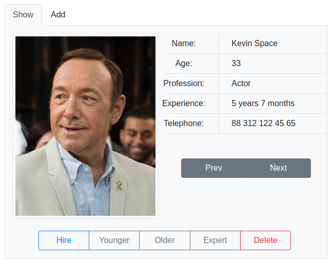
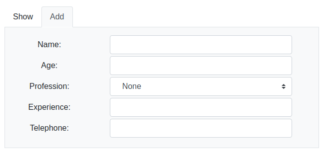

This project was bootstrapped with [Create React App](https://github.com/facebook/create-react-app).

## Available Scripts

In the project directory, you can run:

### `npm start`

Runs the app in the development mode. 
Open [http://localhost:3000](http://localhost:3000) to view it in the browser.

The page will reload if you make edits. 
You will also see any lint errors in the console.

## Enunciated

A job exchange, which offers the service of personnel selection to a company in the financial sector, 
requires a program that allows you to manage the resumes of applicants for different positions in which 
the client company has vacancies.

For the job bank it is important to be able to classify the best applicants according to previously 
defined criteria (years of experience, age and profession), making the assumption that there are no 
two or more applicants with the same name.

The application must allow for (1) the addition of new resumes of applicants, (2) show the list of 
applicants, (3) show the detailed information on an applicant, (4) search by name of the (5) allow 
the list of applicants to be sorted by the different criteria: years of experience, age and profession,
 (6) allow the most experienced applicant to be consulted, (7) allow consult the youngest applicant, 
 (8) hire an applicant (remove it from the list of applicants in the bag) and (9) eliminate those 
 applicants whose experience is less than one specified number of years.
 
 ## Interface
 
 

    
    
 
